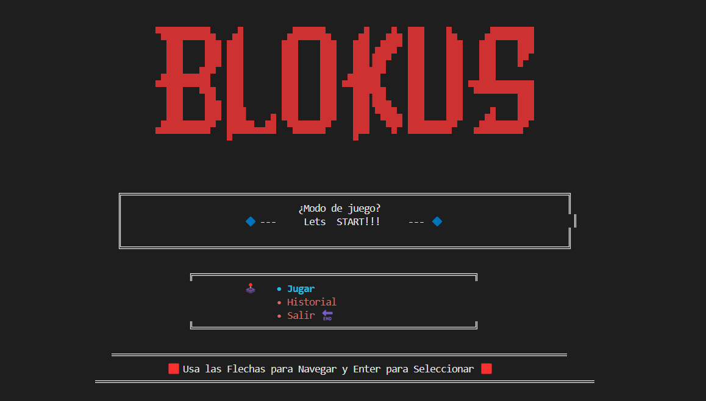

Descripción:
Blokus es una versión sencilla y básica del juego Blokus programada en Python. El juego permite a dos jugadores colocar piezas en un tablero, siguiendo reglas básicas inspiradas en el juego original.

Cómo jugar:

Cada jugador tiene piezas geométricas que pueden colocar en el tablero.

Las piezas deben colocarse siguiendo ciertas reglas (ejemplo: deben tocar solo por esquinas).

El objetivo es colocar todas las piezas o la mayor cantidad posible.

El juego termina cuando ningún jugador puede colocar más piezas.
